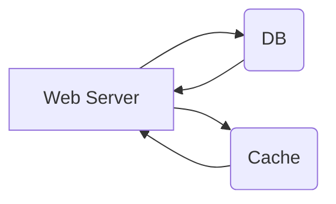
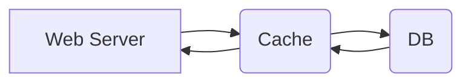

# 4. 用户关系设计
##  QPS 与 常用数据存储系统

###  MySQL/PosgreSQL等SQL数据库的性能
- 约 1k QPS 这个级别

###  MongoDB/Cassandra等硬盘型NoSQL数据库的性能
- 约 10k QPS 这个级别

###  Redis/Memcached等内存型NoSQL数据库的性能
- 100k~1mQPS这个级别


##  Cache
```code
database.set(key, user); cache.delete(key)
```

### Cache Aside



### Cache Through

写多读少： 多DB server + sharding

## Session	
-   用户 Login 以后，为他创建一个 session 对象
-   并把 session_key 返回给浏览器，让浏览器存储起来
-   浏览器将该值记录在浏览器的 cookie 中，key-value
-   用户每次向服务器发送的访问，都会自动带上该网站所有的 cookie
-   此时服务器拿到 cookie 中的 session_key，在 Session Table 中检测是否存在，是否过期
-   Cookie:HTTP协议中浏览器和服务器的沟通机制，服务器把一些用于标记用户身份的信息，传递给 浏览器，浏览器每次访问任何网页链接的时候，都会在 HTTP 请求中带上所有的该网站相关的 Cookie 信息。Cookie 可以理解为一个 Client 端的 hash table。


|Session Table            |                          |                         |
|----------------|-------------------------------|-----------------------------|
|session_key	 |string     |一个 hash 值，全局唯一，无规律|
|user_id		 |foreign key|指向 User Table            |
|expire_at		 |timestamp	 |什么时候过期				|


## NoSql
• Cassandra是一个三层结构的NoSQL数据库
• http://www.lintcode.com/problem/mini-cassandra/ 
- 第一层:row_key : 
	Hash Key, Partition Key
	Cassandra 会根据这个 key 算一个 hash 值 然后决定整条数据存储在哪儿 
	无法进行 Range Query
- 第二层:column_key  
   作为排序用
   Cassandra 支持这样的“范围查询”: query(row_key, column_start, column_end) 
   可以是复合值，如   timestamp + user_id
- 第三层:value
- Cassandra 的 Key = row_key + column_key  
- 同一个 row_key + column_key 只对应一个 value


